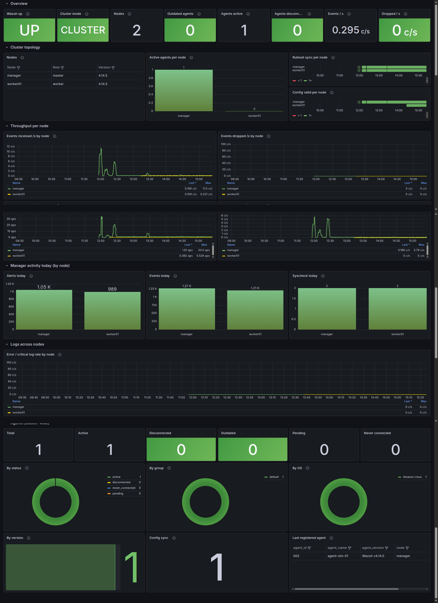
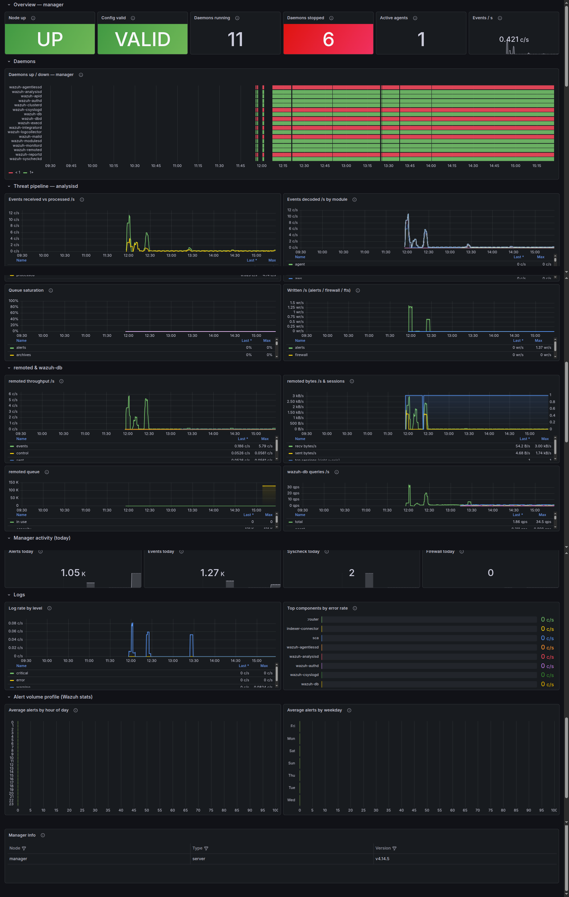
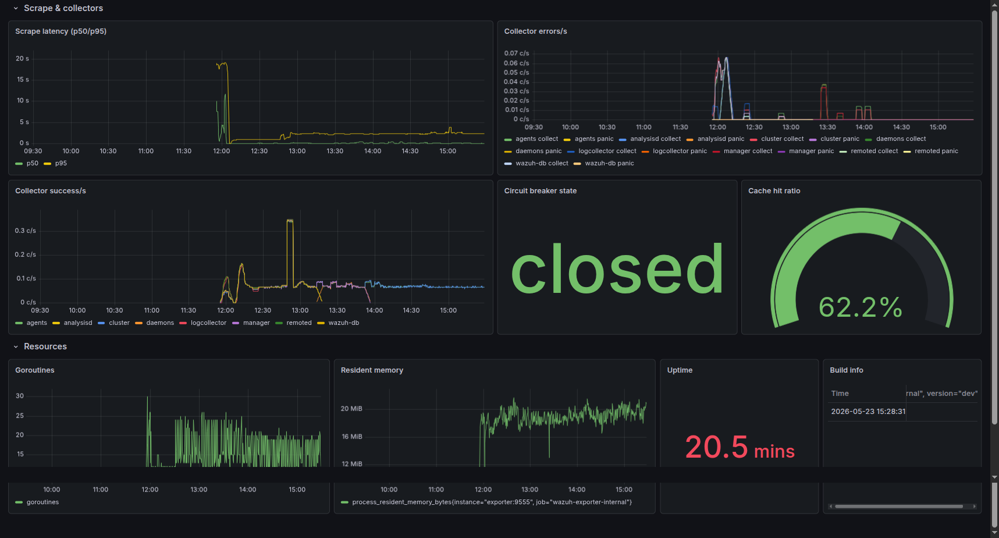

# wazuh-prometheus-exporter

**Prometheus exporter for [Wazuh](https://wazuh.com/)**.

## Quick start

### Docker

```sh
docker run --rm -p 9555:9555 \
  -e WAZUH_API_URL=https://your-wazuh-manager:55000 \
  -e WAZUH_API_USERNAME=wazuh-wui \
  -e WAZUH_API_PASSWORD=... \
  -e WAZUH_API_TLS_SKIP_VERIFY=true \
  ghcr.io/maximewewer/wazuh-prometheus-exporter:latest
```

### Docker compose

```yaml
services:
  wazuh-exporter:
    image: ghcr.io/maximewewer/wazuh-prometheus-exporter:latest
    restart: unless-stopped
    environment:
      WAZUH_LISTEN_ADDRESS: "0.0.0.0:9555"
      WAZUH_NODE_NAME: "wazuh-manager" # `node` label for wazuh_up/cluster_enabled + the standalone node
      WAZUH_API_URL: "https://your-wazuh-manager:55000"
      WAZUH_API_USERNAME: "wazuh-wui"
      WAZUH_API_PASSWORD: "CHANGE_ME" # or WAZUH_API_PASSWORD_FILE to read it from a mounted secret
      WAZUH_API_TLS_SKIP_VERIFY: "true"
    ports:
      - "9555:9555"
```

### Kubernetes

```yaml
apiVersion: v1
kind: Secret
metadata:
  name: wazuh-exporter
  namespace: monitoring
type: Opaque
stringData:
  # The exporter reads the password from this file (WAZUH_API_PASSWORD_FILE).
  password: "CHANGE_ME"
---
apiVersion: apps/v1
kind: Deployment
metadata:
  name: wazuh-exporter
  namespace: monitoring
  labels:
    app.kubernetes.io/name: wazuh-exporter
spec:
  replicas: 1
  selector:
    matchLabels:
      app.kubernetes.io/name: wazuh-exporter
  template:
    metadata:
      labels:
        app.kubernetes.io/name: wazuh-exporter
    spec:
      securityContext:
        runAsNonRoot: true
        runAsUser: 65532          # distroless nonroot
        runAsGroup: 65532
        seccompProfile:
          type: RuntimeDefault
      containers:
        - name: exporter
          image: ghcr.io/maximewewer/wazuh-prometheus-exporter:latest
          ports:
            - name: metrics
              containerPort: 9555
          env:
            - name: WAZUH_LISTEN_ADDRESS
              value: "0.0.0.0:9555"
            - name: WAZUH_API_URL
              value: "https://wazuh-manager.wazuh.svc:55000"
            - name: WAZUH_API_USERNAME
              value: "wazuh-wui"
            - name: WAZUH_API_PASSWORD_FILE
              value: "/etc/wazuh-exporter/password"
            # Prefer a CA bundle (WAZUH_API_CA_FILE) over skipping verification.
            - name: WAZUH_API_TLS_SKIP_VERIFY
              value: "true"
            # Keep the cache TTL >= your Prometheus scrape interval.
            - name: WAZUH_CACHE_TTL
              value: "30s"
          volumeMounts:
            - name: secret
              mountPath: /etc/wazuh-exporter
              readOnly: true
          securityContext:
            allowPrivilegeEscalation: false
            readOnlyRootFilesystem: true
            capabilities:
              drop:
                - ALL
          resources:
            requests:
              cpu: "25m"
              memory: "32Mi"
            limits:
              cpu: "200m"
              memory: "128Mi"
          # startupProbe absorbs a slow Wazuh API: /ready stays 503 until the first
          # collection succeeds; the pod gets up to 30*5s = 150s before liveness
          # begins. Raise failureThreshold if your manager boots slower.
          startupProbe:
            httpGet:
              path: /ready
              port: metrics
            periodSeconds: 5
            failureThreshold: 30
          livenessProbe:
            httpGet:
              path: /health
              port: metrics
            periodSeconds: 15
          readinessProbe:
            httpGet:
              path: /ready
              port: metrics
            periodSeconds: 10
            failureThreshold: 3
      volumes:
        - name: secret
          secret:
            secretName: wazuh-exporter
            items:
              - key: password
                path: password
---
apiVersion: v1
kind: Service
metadata:
  name: wazuh-exporter
  namespace: monitoring
  labels:
    app.kubernetes.io/name: wazuh-exporter
  annotations:
    prometheus.io/scrape: "true"
    prometheus.io/port: "9555"
    prometheus.io/path: "/metrics"
spec:
  selector:
    app.kubernetes.io/name: wazuh-exporter
  ports:
    - name: metrics
      port: 9555
      targetPort: metrics
```

## Endpoints

| Path                | Purpose                                                         |
|---------------------|-----------------------------------------------------------------|
| `/`                 | HTML info page                                                  |
| `/health`           | Liveness — JSON `{status,version,uptime_seconds}`, 200 once serving |
| `/ready`            | Readiness — 200 once a collection has succeeded (sticky), else 503  |
| `/metrics`          | Wazuh domain metrics (`wazuh_*`)                                |
| `/internal/metrics` | Exporter self-metrics (`wazuh_exporter_*`, `go_*`, `process_*`) |

Default listen address: `:9555`.

## Documentation

- **[Configuration](docs/configuration.md)** — every environment variable, defaults, and the Wazuh API RBAC read permissions required.
- **[Metrics](docs/metrics.md)** — every exported metric, its type and labels.
- **[Dashboards](#dashboards)** — three ready-to-import Grafana dashboards in [`grafana/dashboards/`](grafana/dashboards/) (previewed below).

## Dashboards

Three Grafana dashboards ship in [`grafana/dashboards/`](grafana/dashboards/) — import them or provision the folder (they use a `DS_PROMETHEUS` datasource variable).

### Wazuh — Fleet
All nodes at a glance: health overview, cluster topology, per-node throughput comparison, manager activity, and cluster-wide agents. Per-node panels use tables / bar charts that stay readable as the cluster grows.



### Wazuh — Node
Single-node deep dive (pick a node from the dropdown): daemon run-state, the analysisd / remoted / wazuh-db internals, logs, and the hourly/weekly alert-volume profiles.



### Wazuh Exporter — Internal
The exporter's own health: scrape latency, per-collector errors/success, circuit-breaker state, cache hit ratio, and Go runtime / process resources.



## License

Apache 2.0 — see [LICENSE](LICENSE).
